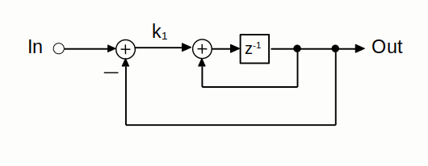
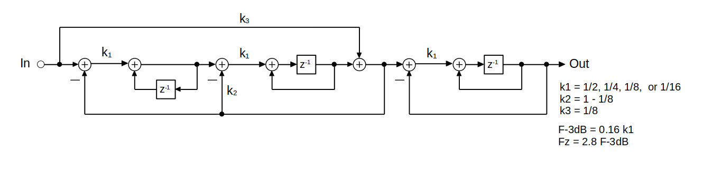

# FilterIntro
When realizing digital filters in hardware, and when high-speed operation is important, a popular choice is to use two's complement arithmetic for the signal-processing operations. Often, the initial design debugging is done using a high-level simulation but with bit accurate operations.
The TwoCmplt Library is intended to help simulate high-level, bit-accurate
filters with minimal effort.

## Approach

The signal-flow-graph of a simple first-order filter is shown directly below



In this example, the muliplier is realized by a new approach for impementing a
multiplication where the multiplication is by a fixed coefficient that either is
a constant or changes only slowly. The multiplication is realized using the struct
```TwosCmplt/CoeffMlt```. The example of using this struct is found in the swift executable file
Filter3A.swift found in Examples/Filter3A/ in the main project directory. Note the other
examples are also all under Examples from the main project directory. Additional documentation
on the Examples can be found in ExamplesDoc/ExamplesDoc.docc. Some of the examples write their
impulse response into the PlotResponse directory. The FFT magnitude of the impulse response can
be displayed (and optionally saved to a png or pdf file) using python3 anal_functs <example_name.dat>

Another illustrative example is:



This filter can be realized without using multipliers and can have its -3dB frequency changed over
a wide range while it's shape remains constant. It and some similar architectures where used
in early ADSL systems.
